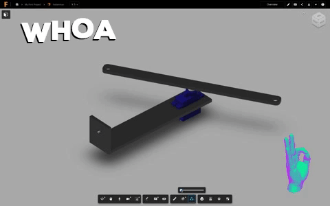

# Hoberman Sphere Device !
## Inspiration
The Hoberman sphere is a complex and intriguing toy with a very simple operation.  I wanted to provide this toy with some autonomy and character by allowing it to open and close without a human physically opening and closing it. My plan was to connect the sphere to a servo motor with fishing line to give the effect that the sphere is floating and moving on its own. My initial idea for the interaction was to open and close the sphere using a controller called a [Leap Motion](https://www.leapmotion.com/). I wanted to give the user the feeling of opening and closing the sphere with their fist. 

## Actuator

My first step was building the actuator.  In order to open and close the sphere while keeping the center point stationary, I connected the fishing line to the top and bottom of the sphere.  The ends of the line were then connected to the arms of the servo motor so the top and bottom of the sphere were lowered and raised.  The fishing line was thread through a hole below the servo motor to keep the sphere stationary during actuation.  The actuator was designed in Fusion 360 and laser cut.

And this the actual thing working !

## Interaction

Once the actuator was complete, the next step was to implement the Leap Motion interaction. People have had success using the Leap Motion with a Raspberry Pi but it required the Leap motion to be plugged into a computer and send the data to Pi.  While this was feasible, I didn’t want my system to require a full fledged computer. I decided the sphere could open based on the user's proximity to the sphere.  I initially experimented with the [VCNL4010](https://www.adafruit.com/product/466) light sensor.  This gave me very precise control of the sphere but gave me a very small range, about 2 cm.  JD graciously lent me his [Infrared Proximity Sensor](https://www.sparkfun.com/products/8958).  This sensor provided a larger range of about 2 ft. The signal was quite noisy so JD recommend I implement a moving exponential average of the input.  It worked really well!  Then I got a little to confident and shorted the sensor pretty bad. Once I setup the circuit correctly the sensor was no longer working 😔 (Don’t worry JD I have a new one for you).  I then transitioned to a [Sonic Distance sensor](https://www.digikey.com/product-detail/en/sparkfun-electronics/SEN-13959/1568-1421-ND/6193598&?gclid=EAIaIQobChMI1fbmh5SH3wIVCv_jBx23VgIZEAQYAiABEgLnr_D_BwE).  It has a great range but is a bit noisy even with the averaging in place.  

Once I had all of the technical bits working I configured the the setup onto a lamp. 

[Here](https://drive.google.com/open?id=171bZITz-VX-Srauev-xj7-2kcAlAN8kK) Is Skylar interacting with the sphere!

## Open Studio Plan

For open studio I am planning on hanging the sphere from a light in the Maker Lab instead of a lamp.  I am also considering changing the actuation input to sound instead of the distance sensor.  That way, the sensor can be hidden and will hopefully be less buggy. 
